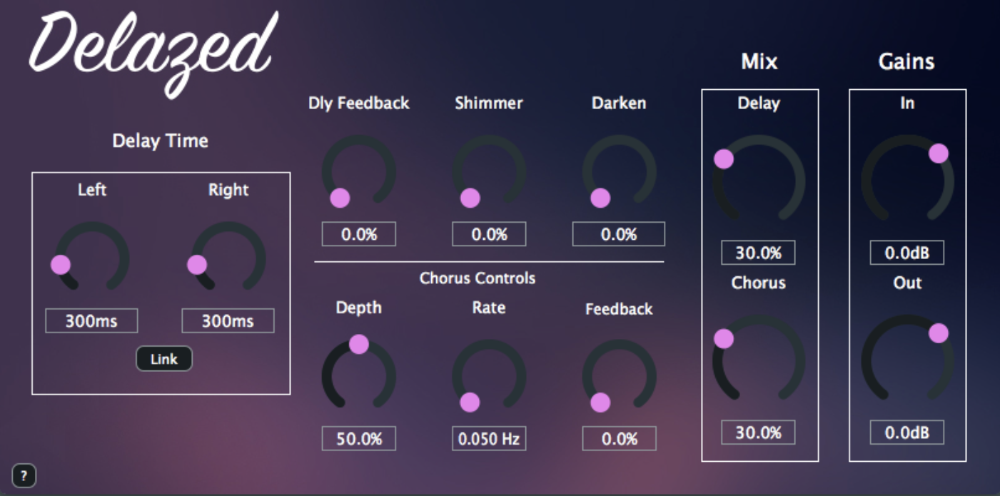
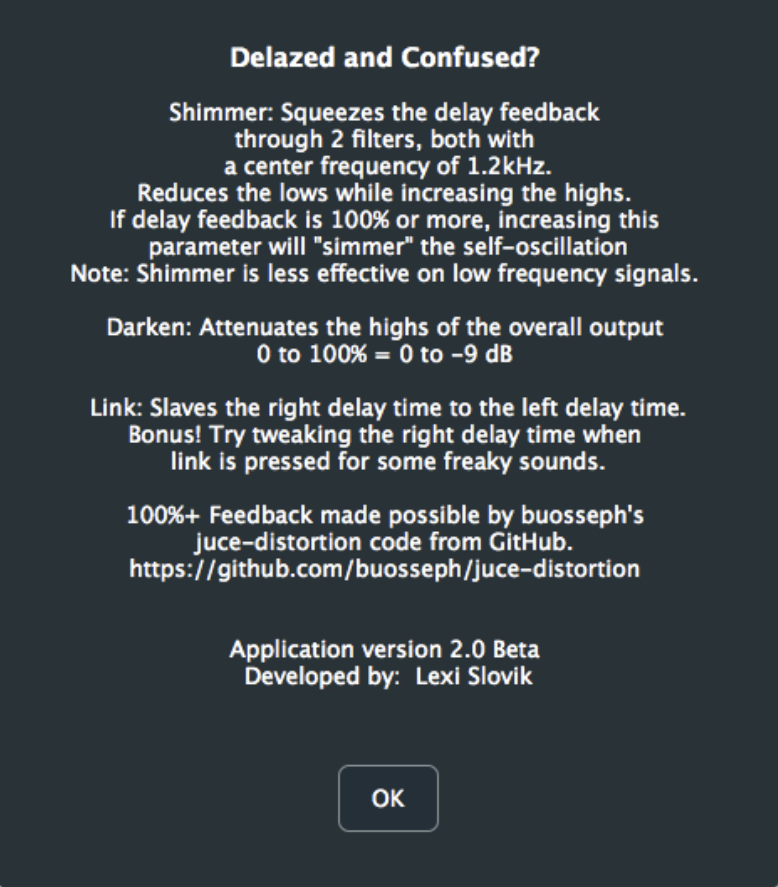

# Delazed
## VST and Audio Unit Effect Plug-in

## About
Delazed is a digital audio effect I designed in order to create new and exciting sounds. I wanted to emulate analog tape delay and make use of the quirks of the digital environment to create purposeful "mistakes" that generate unique sounds.

## Table of Contents
* [Description](#description)
* [Layout](#layout)
* [Technical](#technical)
* [License](#license)
* [Credits](#credits)

### Description
Delazed is a chorus effect that is fed into ping pong delay. I made use of soft clipping and filters in order to allow for lots of feedback from both the chorus and the delay.

These are the following parameters available and their corresponding ranges:
- Delay Time L: 0 - 2000ms
- Delay Time R: 0 - 2000ms
- Link: 0 or 1 (pressed or not pressed)
- Delay Feedback: 0 - 101%
- Shimmer: 0 - 100%
- Darken: 0 - 100%
- Depth: 0 - 100%
- Rate: 0.001 - 20 Hz
- Chorus Feedback: 0 - 100%
- Delay Mix: 0 - 100%
- Chorus Mix: 0 - 100%
- Input Gain: -12 to +6 dB
- Output Gain: -12 to +6 dB

I also included a [?] button for users to click whichs opens a new window with more information about the plug-in.

### Layout

### Technical
I really wanted to achieve self-oscillation through the delay feedback, so I set a threshold where if feedback > 99%, the signal will be processed through the softClip function. The same is true for chorus feedback. In order to avoid signal overload from having two feedback instances, I set another threshold so that if the delay feedback + chorus feedback >= 1.0, the entire signal would be process through the softClip function.

I liked the idea of having some control over the timbre, so I added the shimmer and darken parameters. Shimmer sends the signal through a low shelf filter then through a high shelf filter. The center frequency for both filters is 1.2 kHz. For the most part, the range 0 - 100% is converted to 0 to -6 dB for the low shelf and 0 to +0.5 dB for the high shelf simultaneously. To avoid overload, I set a threshold so that if the delay feedback is above 92%, the high shelf gain maxes out at 0.0 dB (or no gain); if the delay feedback is 100% or more, the high shelf actually starts attenuating 0 to -1 dB. Darken sends the entire signal chain though a low shelf filter at the end. The center frequency is 300 Hz and the user defines the gain; 0 - 100% converts to 0 to -9 dB.

The chorus feedback is also being processed through a filter — only after the chorus feedback exceeds 80%. From 80% to 100%, the user is controlling the filter attenuation along with the chorus feedback. The frequency center is static (900 Hz) and the 80% to 100% becomes a range of 0 to -3 dB. I implemented this filter because the timbre of the chorus feedback through soft clipping was a bit overwhelming, but I still wanted the user to be able to crank it to 100%. This way the signal doesn’t overload, nor does it take over the sound with soft clipped chorus feedback.

I like having ambiguous parameter names like “shimmer” and “darken” because it forces the user to use their ears more than their eyes. Since the names and ranges are a bit ambiguous, I included a [ ? ] button that opens a window with a brief explanation. The window looks like this:

## License
This application is covered under the GPLv3 license.

[Read about GPL v3 License](https://www.gnu.org/licenses/gpl-3.0)

## Credits
This application was made using [Projucer](https://juce.com/get-juce). I actively developed this plug-in while a student at University of Oregon in 2018.

[Juce-Distortion](https://github.com/juce-distortion)
